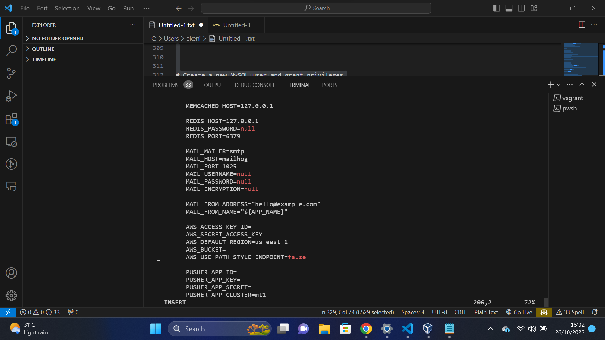

**Cloud Engineering Second Semester Examination Project**

**Objective**

Automate the provisioning of two Ubuntu-based servers, named "Master" and "Slave," using Vagrant. On the Master node, create a bash script to automate the deployment of a LAMP (Linux, Apache, MySQL, PHP) stack. This script should clone a PHP application from GitHub, install all necessary packages, and configure Apache web server and MySQL. Ensure the bash script is reusable and readable.
Using an Ansible playbook:
Execute the bash script on the Slave node and verify that the PHP application is accessible through the VM's IP address (take a screenshot of this as evidence).
Create a cron job to check the server's uptime every 12 am.

**EXECUTION**
A Vagrantfile, a configuration file for defining the virtual machine environment, is generated at the start of the process. The "master" and "slave" virtual machines are configured.

The script defines the base box to be used (in this case, "ubuntu/focal64"), configures the "master" virtual machine, gives the "master" a private network IP address (192.168.232.10) and gives the virtual machine memory and CPU resources. A shell script defines the provisioning steps for the "master" and performs the following actions:
- Produces a pair of SSH keys without a passphrase.
- Transfers the public key of SSH to the "slave" computer in order to allow password-free SSH access.
- Modifies and enhances system package content.
As with the "master," the "slave" virtual machine is configured by the script. It identifies the base box, allots resources, designates provisioning steps, and assigns a private network IP (192.168.232.11). The "slave" provisioning script allows SSH password authentication for key copy, makes sure the SSH server is installed, and restarts the SSH service. Additionally, it updates and upgrades system packages.

Using the vagrant up command, the script lastly initializes and launches the Vagrant environment. This command sets up the virtual machines that are specified and reads the Vagrantfile.

It creates and runs a deploy.yml file, which is an Ansible playbook that outlines a number of tasks that need to be carried out on remote hosts, It performs the following tasks:
- Installs essential packages.
- Configures the firewall (UFW).
- Installs and configures Apache.
- Installs MySQL and runs the MySQL secure installation script.
- Installs and configures PHP.
- Configures PHP settings.
- Installs Git and Composer.
- Configures Apache for Laravel.
- Clones the Laravel application from a GitHub repository.
- Sets Laravel permissions.
- Configures the Laravel .env file.
- Sets up the database for Laravel. Additionally, an inventory file is generated, which instructs Ansible on where to execute the tasks listed in the playbook, which specifies the target hosts on which Ansible will function. In this instance, it includes the IP address of the "Slave" machine, which is 192.168.232.9. 

I proceeded to paste the IP address in my browser after the script ran, and I was able to access the Laravel documentation page. 

